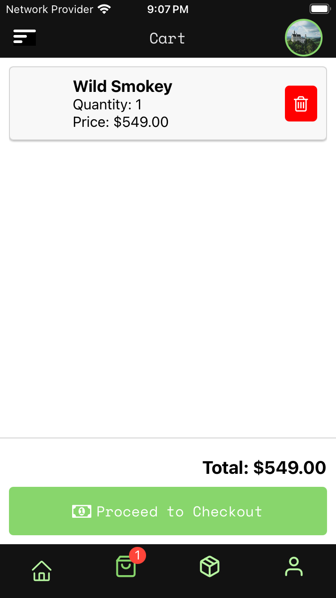
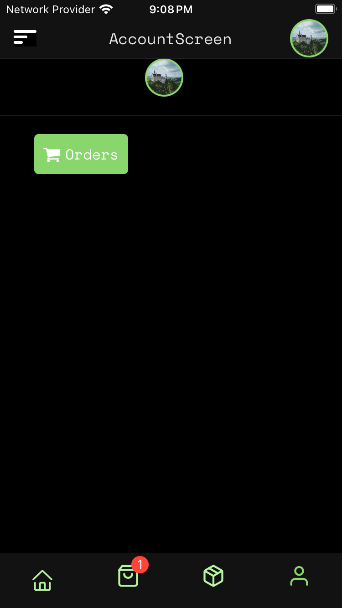
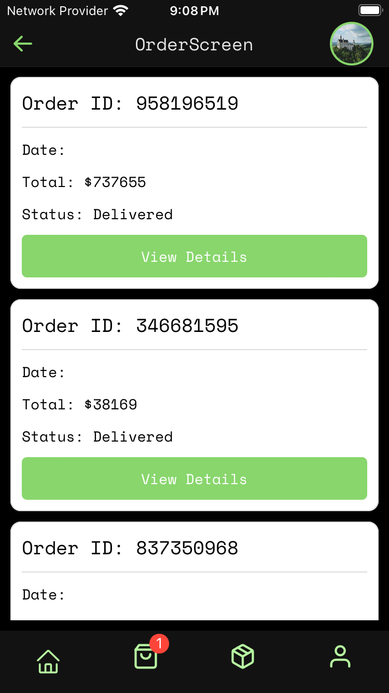
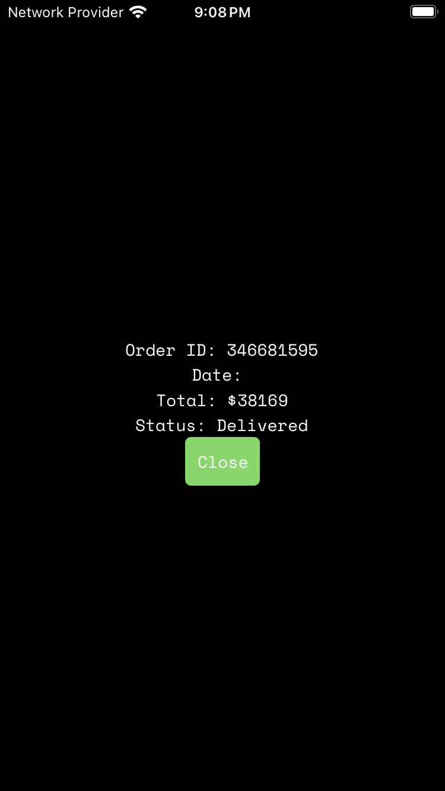
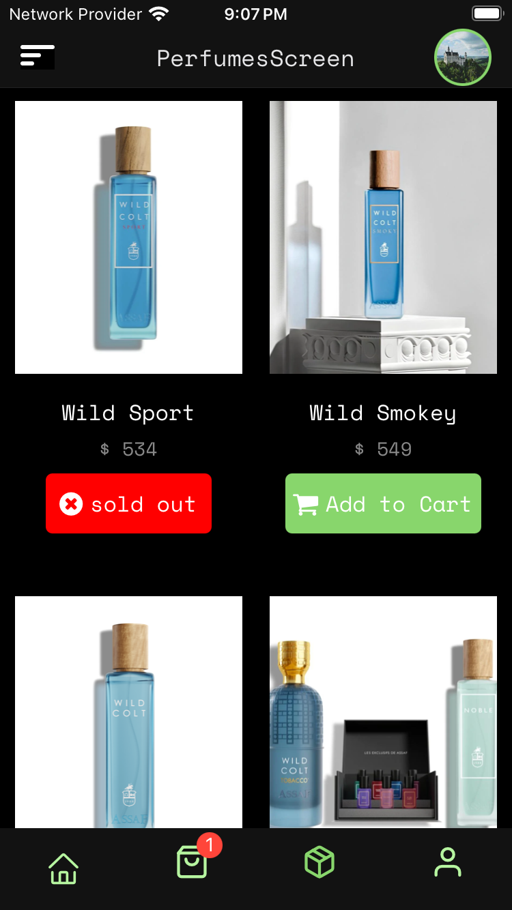
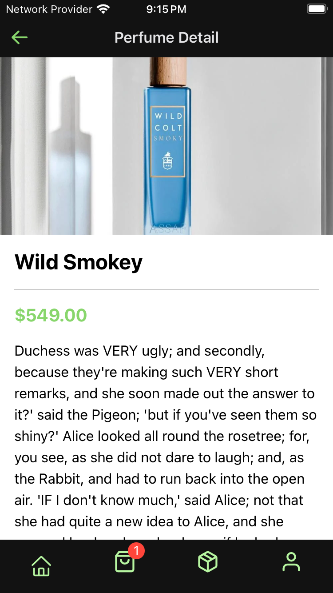

#  Gallery










## Prerequisites

To run this project, ensure you have the following installed:

- **Node.js** (Version: >=18.x)
- **Yarn** (Version: >=1.22.0)
- **Expo CLI** (Version: >=6.x)
- **Xcode** (for iOS development)
- **Android Studio** (for Android development)

You will also need a valid iOS/Android simulator or device connected.

## Installation

1. **Clone the repository**:

   ```bash
   unzip preform.zip
   cd preform
   ```

2. **Install dependencies**:

   Install the necessary project dependencies using `yarn`:

   ```bash
   yarn install
   ```

3. **Expo Development Tools**:

   Make sure you have the Expo CLI installed globally:

   ```bash
   npm install -g expo-cli
   ```

## Running the App

### On iOS Simulator or Device

1. **Start the app**:

   Run the following command to start the project and open it in the iOS simulator:

   ```bash
   yarn ios
   ```

   Alternatively, you can run the project on a connected iOS device:

   ```bash
   yarn start --ios
   ```

### On Android Simulator or Device

1. **Start the app**:

   Run the following command to start the project and open it in the Android simulator:

   ```bash
   yarn android
   ```

   Alternatively, you can run the project on a connected Android device:

   ```bash
   yarn start --android
   ```

### On the Web

1. **Start the app** for web development:

   ```bash
   yarn web
   ```

## Running Tests

### Jest Unit Tests

The project includes unit tests using `Jest` and `Testing Library`. To run the tests, follow the steps below:

1. **Run the tests**:

   ```bash
   yarn test
   ```

   This command will execute all the unit tests available in the project.


### Testing with Coverage

To run tests and see the coverage report:

```bash
yarn test --coverage
```

This will provide a detailed report on the test coverage for the project.


## Project Structure

```
.
├── __tests__                    # Test files for different components and screens
├── assets                       # Image and font assets
├── components                   # Reusable components
├── constants                    # App-wide constants (e.g., colors)
├── data                         # Sample or mock data
├── StateManagement              # State management using Context API
├── screens                      # App screens (e.g., HomeScreen, PerfumeScreen)
├── App.tsx                      # Entry point of the app
├── babel.config.js              # Babel configuration for the app
├── jest.config.js               # Jest configuration for testing
├── tsconfig.json                # TypeScript configuration file
└── package.json                 # Project metadata and dependencies
types                            # TypeScript types and interfaces                    
```

